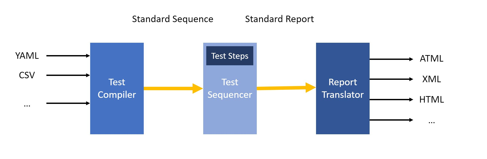
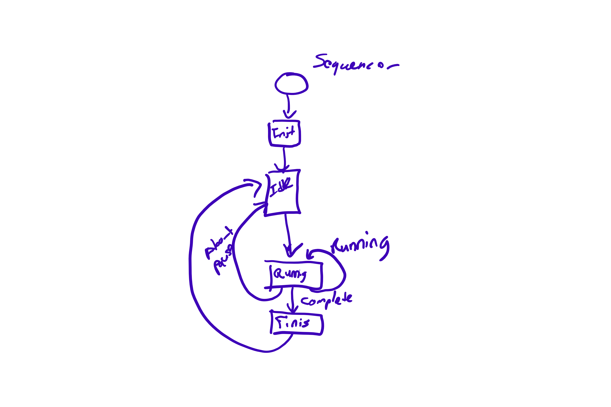

# Sequencer DCAF Module Design Document

## Sequencer

The sequence will be a Dynamic DCAF module  that has the capability to execute the steps defined in a sequence in the order established in the sequence.

## Sequencer Config

### Sequence Compiler
This VI Compiles the Sequence into the Standard Sequence String Format  that can be used to create a Sequence Object.

### Sequence File

## Sequencer Runtime
The sequencer should be able to publish its state through tags, and also be controlled through tags.
It should have the option to moving to a specific state

Tag Name		  | Data Type  |  Description
--|---|--
Start               |Boolean	|Starts the Active Sequence
Change Sequence     |Boolean	|Changes the Active Sequence (only works at the start of the Sequence)
New Sequence Number	|I32      |	New Sequence Number
Pause	              |Boolean	|Sets the Sequence to Idle but keeps track of the active step
Abort	              |Boolean  |	Finishes the Sequence Skipping the missing Steps
Jump to Step	      |Boolean  |	Changes the Active Step in the Sequence to the specified Step. Only Works if Paused
Step ID	            |I32    	|ID of the Selected Step
Table 1 Sequencer Control Tags

Insert table of state tags

Tag Name   |	Data Type	| Description
--|---|--
Sequencer State |	I 32	|I 32 for the value of the enum representing the state.
Active Sequence Number	|I 32 |
Active Sequence Name	|String |
Active Step	|I 32 |
Step State	|I 32	|I 32 for the value of the enum representing the state.

## Sequencer UI
There are 2 main components of UI for configurating the Sequencer and not both of them need to be in the DCAF Editor

Option 1:
Stand alone configurator:
•	Sequence configurator
Module UI:
•	Select Sequences
•	Map Tags

Options 2:
This option might give us additional Flexibility and might be the better option.
Module UI:
•	Select Sequences
•	Map Tags
•	Sequence configurator

## Sequence
A sequence represents a group of steps that needs to be executed in a specific order. Users don’t need to create new Sequence Classes. As the instance of the Sequence will be build based on the configuration.
In the Case of DCAF the sequences are represented by 2 Classes:

### Sequence Configuration
This is the configuration interface for the sequencer

Property	|Data Type	|Description
--|---|--
Name	| |
Steps	| |
Version	| |

### Sequence Runtime

## Steps
### Definition
 The step is the basic unit of execution of the sequencer. Each step should know its own state and be able to keep its step information.  Step should not use Functional global variables, instead they should use  the private data of the class to store this information
Steps should be not blocking.

### Step Configuration
The step Configuration should not include any dependencies to the runtime or UI. The step configuration defines the information that will be saved to a file.
### Properties
Runtime Name
Editor Name
Skip
Unique ID
Alias (Label)

### Methods

Step Runtime
Step State
Step UI
Template

## Basic Steps
### Label
### Wait Step
### Update Tag
### Parallel Step
### Conditional Jump

## Complex steps
### Configure tdms
### Force
### while
