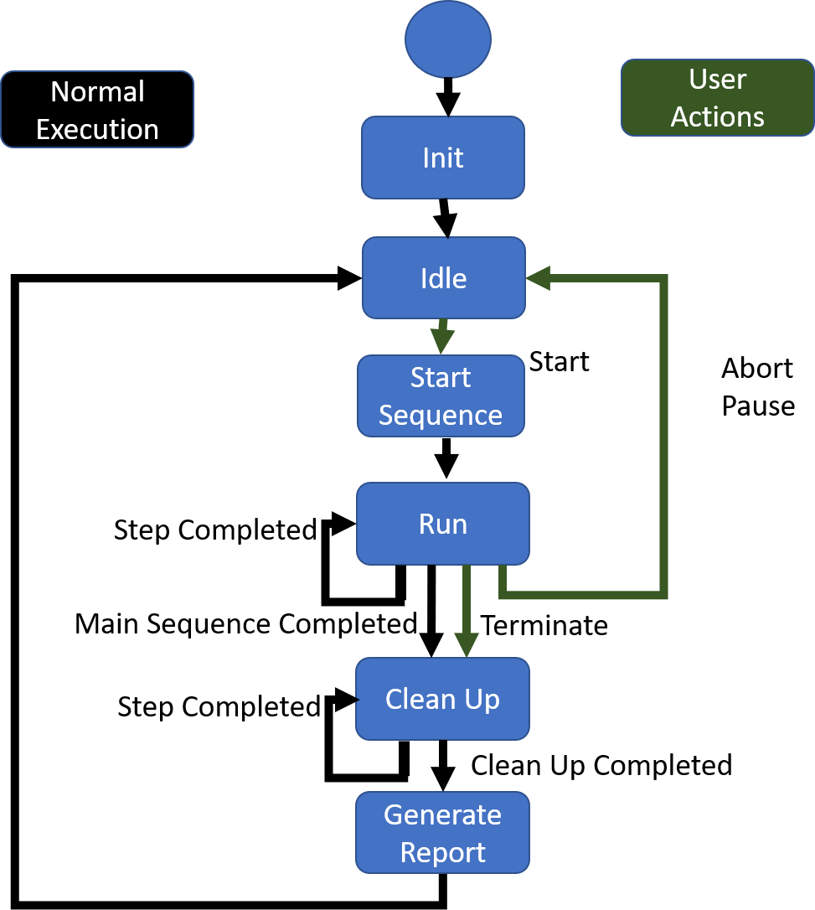

# Sequencer DCAF Module Design Document

## Sequencer

The sequence will be a Dynamic DCAF module  that has the capability to execute the steps defined in a sequence in the order established in the sequence.

## Sequencer Config

### Sequence Compiler
This VI Compiles the Sequence into the Standard Sequence String Format  that can be used to create a Sequence Object.

### Sequence File

## Sequencer Runtime
The sequencer should be able to publish its state through tags, and also be controlled through tags.
It should have the option to moving to a specific state

Tag Name		  | Data Type  |  Description
--|---|--
Start               |Boolean	|Starts the Active Sequence
Change Sequence     |Boolean	|Changes the Active Sequence (only works at the start of the Sequence)
New Sequence Number	|I32      |	New Sequence Number
Pause	              |Boolean	|Sets the Sequence to Idle but keeps track of the active step, it can be resume with a start command.
Abort	              |Boolean  |	Stops the sequencer without executing any other steps or the cleanup.
Terminate           |Boolean  |   
Jump to Step	      |Boolean  |	Changes the Active Step in the Sequence to the specified Step. Only Works if Paused
Step ID	            |I32    	|ID of the Selected Step
Table 1 Sequencer Control Tags

Insert table of state tags

Tag Name   |	Data Type	| Description
--|---|--
Sequencer State |	I 32	|I 32 for the value of the enum representing the state.
Active Sequence Number	|I 32 |
Active Sequence Name	|String |
Active Step	|I 32 |
Step State	|I 32	|I 32 for the value of the enum representing the state.

## Sequencer UI
The sequencer UI Module allows to configures the Tag for the sequencer and its steps. It also allows us to add the sequencers available in the sequencer.

## Sequence
A sequence represents a group of steps that needs to be executed in a specific order. Users don’t need to create new Sequence Classes. As the instance of the Sequence will be build based on the configuration.
In the Case of DCAF the sequences are represented by 2 Classes: Sequence and Sequence configuration.

### Sequence Configuration
This is the configuration interface for the sequencer

Property  |Data Type	         |Description
--|---|--
Name	    | String                  | Name of the sequence
Steps	    | Step Configuration array| Contains all the configuration steps in order.
Version	  | String                  | String defining the version of the sequence

### Sequence Runtime
The sequence runtime is what is used by the sequencer during runtime. It consist of an array of steps, and a result list.

Property  |Data Type	         |Description
--|---|--
Name	           | String                  | Name of the sequence
Steps	           | Step array              | contains the steps.
Clean Up index   | I32       | Index of where the normal sequence and the cleanup are Divided.          
Result List      |Array of step results   |contains the results from all the steps  

## Steps
### Definition
 The step is the basic unit of execution of the sequencer. Each step should know its own state and be able to keep its step information.  Step should not use Functional global variables, instead they should use  the private data of the class to store this information
Steps should be not blocking. Each step should contain 2 classes (step and step config) and a test library.

### Step Configuration
The step Configuration should not include any dependencies to the runtime or UI. The step configuration defines the information that will be saved to a file.
### Properties
Property       | Data Type  |  Description
--|--|--
Runtime Step   | Steps   |  Runtime of the step, this should be replaced with name
Runtime Name   | String  |  Name of the runtime class (not Implement)
Editor Name    | String  |  If we are using a editor a name to the class
Skip           | Boolean |  Decides if the step is skipped
Runtime Alias  | String  |  Name to match to the UI display
Version        | String  |  Version of the step
Add to Report  | Boolean |  Decides if the item will be added to the report

### Methods
Method Name        | Description
--                 |--
From String Array  |  Creates a Step configuration object from a string array
To String array    |  Creates a String array from a step configuration
Init Runtime       |  Initializes the Runtime of the step

### Step
This is the runtime class of the step. This is what will be inside of the sequence and will be run by the sequencer. All data of the step should be store in the step private data, and it should not use variables or global resources.

Methods
Method Name     | Description
--              |--
Step Process    |  Controls the order of execution of the other methods.
Run Step        |  This is where most of the logic of a step is included. it determines when the step is completed.
Flow Control    |  Updates the Flow component of the step. Most Steps wont need to update this as they normally go to next step.
Create Results  |  Populates the step results object.

#### Properties
Property       | Data Type  |  Description
--|--|--
Step State     |Step State  | Contains the possible state of a step.

Step States | Description
-- | --
Start       | The sequencer set the step to this step the first time it is called in a sequence
Skipped     | If the step is skipped it is set to this. We are including this so it can be reported in the Results  
Timeout     | Step Timed out, right now it behaves as completed but is reported as timeout.  
Completed   | Step has completed its normal execution  
Running     | The step is executing
Aborted     | The sequence was aborted or terminated during this step.  

## Basic Steps
### Label
This step doesn't have any runtime implementation and is a placeholder for a jump.
### Wait Step
This step will wait for a fixed amount of time.

### Wait On Boolean
This step will wait until a Boolean is set to true or the timeout value is reached.

### Update Tag
This Step updates the value of a tag.

### Parallel Step
This step allows the execution of multiple steps in a single engine cycle

### Conditional Jump
This step moves the sequencer pointer to the specified step.

### Counter
Counts how many times it has been executed. In conjunction with the conditional jump it works as a for.

### Test Numeric Limits
Compares a number against a upper or lower limit.

### Test String
Compares a string against a value or a regular expression
