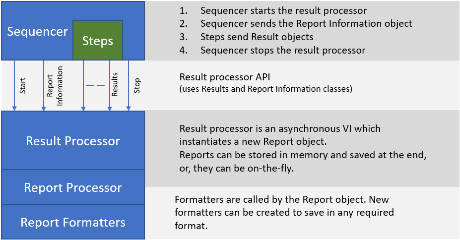

# Result Processor Details

The result processor is an asynchronous process with an API you can use to 
control the worker and modify your report. This image shows the software 
architecture.

## AsyncWorker control API

This API is used to start, monitor and stop the worker.

### StartAsyncWorker

This starts the worker on another thread. Pass an object of the 
ResultProcessor Config class to this and keep the object of the 
ResultProcessor it returns. This will be used for ALL other communication, 
including the Results API.

### CheckWorkerError

Returns an error cluster containing any errors the processor encountered. The 
worker does not stop on error. This means that it is the job of the owner to 
act on the errors, they will be enqueued and forgotten about by the processor.

### StopAsyncWorker

This will send the Stop message to the worker. If the result processor is 
on-the-fly then your report will have been saved to disk. If not, the report 
will be lost unless you first call Publish Report.

## Result Processor API

There are a few things we need to fix here so I won't document everything yet. 
These are the calls available, they should be used as they are named.

1. Start New Report
2. Add DUT Information
3. Add Test Information
4. Add Station Information
5. Add Report Information - This will write DUT, Station and Test information all at once.
6. Add Result - Steps should call this
7. Publish Report - For on-the-fly reporting this doesn't do anything.